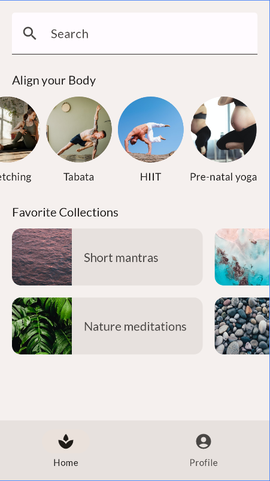

🧘‍♀️ MySoothe – Wellness UI com Jetpack Compose
Este projeto é um app de exemplo desenvolvido com Jetpack Compose para Android, inspirado em experiências de bem-estar e relaxamento. O foco está no uso de layouts modernos, componentes compostáveis e adaptação responsiva com base no tamanho da tela.

✨ Funcionalidades
🔍 Barra de busca com ícone e placeholder customizados

🧘 Seção “Align Your Body” com rolagem horizontal de práticas visuais

💖 Coleções favoritas apresentadas em grade horizontal com rolagem

📱 Modo retrato e paisagem, com bottom navigation ou navigation rail, dependendo da largura da tela

🖼️ Imagens circulares e cartões estilizados com MaterialTheme

🎨 Tematização moderna com Material3 (Material You)

🔧 Tecnologias
Jetpack Compose

Material 3

Scaffold, LazyRow, LazyHorizontalGrid

Responsive UI (WindowSizeClass API)

Android Studio Preview Annotations

📦 Estrutura modular
O código está organizado em componentes reutilizáveis e demonstra práticas recomendadas de desenvolvimento moderno com Compose, incluindo o uso de @Preview, Modifier, @Composable, @DrawableRes, e @StringRes.

🚀 Objetivo
Este app serve como base ou inspiração para projetos reais de apps de bem-estar, saúde ou qualquer outra aplicação que precise de um layout bonito, fluido e responsivo.

